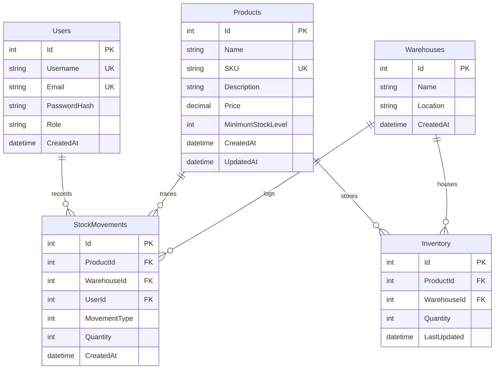

# 📦 StockFlow

A full-stack **Inventory Management System** built with **React + Vite** on the frontend and **ASP.NET Core Web API + Entity Framework Core + SQL Server** on the backend.

StockFlow is designed to demonstrate practical backend and full-stack development concepts such as **JWT authentication, role-based authorization, layered architecture, inventory validation, atomic stock operations, audit logging, database constraints, dependency injection, and RESTful API design**.

---

## 🚀 Features

### 🔐 Authentication & Authorization

- JWT-based stateless authentication
- BCrypt password hashing
- Role-based access control with **Admin** and **Employee** roles
- Backend authorization using `[Authorize]`
- Admin-only operations protected at the API level
- JWT stored and attached to requests by Axios on the frontend
- Unauthorized actions return appropriate `401` / `403` responses

### 📦 Product Management

- Create, view, update, and delete products
- Unique SKU validation
- Product search
- Pagination
- Minimum stock level configuration

### 🏢 Warehouse Management

- Create, view, update, and delete warehouses
- Store warehouse location details
- Manage inventory across multiple warehouses

### 📊 Inventory Management

- View current inventory levels
- Stock-in operations
- Stock-out operations
- Prevent stock from becoming negative
- Low-stock detection based on minimum stock level
- Track inventory separately for each product and warehouse

### 📝 Stock Movement History

- Record every stock-in and stock-out operation
- Store product, warehouse, user, quantity, movement type, and timestamp
- Preserve historical movement records using restricted delete behavior

### 🛡️ Backend Reliability

- Custom global exception handling middleware
- Dependency Injection
- EF Core migrations and database seeding
- LINQ-based database queries
- SQL Server constraints and indexes
- Consistent API error responses
- Built-in logging using `ILogger`

### 📚 API Documentation

- Swagger / OpenAPI integration
- Interactive API testing through Swagger UI
- Clearly separated REST endpoints for authentication, products, warehouses, inventory, and stock movements

---

## 🏗️ Architecture

```text
                         ┌───────────────────────┐
                         │      React Client     │
                         │     Vite + Axios      │
                         └───────────┬───────────┘
                                     │
                           HTTP + JWT Bearer
                                     │
                                     ▼
                    ┌─────────────────────────────┐
                    │     ASP.NET Core Web API    │
                    │                             │
                    │  CORS / Exception Middleware│
                    │             │               │
                    │             ▼               │
                    │       Controllers           │
                    │             │               │
                    │             ▼               │
                    │        Services             │
                    │     Business Logic          │
                    │             │               │
                    │             ▼               │
                    │        EF Core              │
                    │         DbContext            │
                    └─────────────┬───────────────┘
                                  │
                                  ▼
                            ┌─────────────┐
                            │  SQL Server │
                            │ StockFlowDb │
                            └─────────────┘
```

### 🔄 Request Flow

```text
Client Request
     │
     ▼
Axios
     │
     ▼
JWT Bearer Token
     │
     ▼
ASP.NET Core Middleware
     │
     ├── Exception Handling
     └── CORS
     │
     ▼
Controller
     │
     ├── Authentication / Authorization
     └── Request Validation
     │
     ▼
Service Layer
     │
     ├── Business Rules
     ├── Inventory Validation
     ├── LINQ Queries
     └── Stock Movement Logging
     │
     ▼
EF Core DbContext
     │
     ▼
SQL Server
```

---

## 🛠️ Technology Stack

| Layer | Technology |
|---|---|
| Frontend | React |
| Build Tool | Vite |
| Frontend Language | JavaScript ES6+ |
| Routing | React Router DOM |
| HTTP Client | Axios |
| Styling | Vanilla CSS |
| Backend | ASP.NET Core Web API |
| Language | C# |
| Framework | .NET 8 |
| ORM | Entity Framework Core 8 |
| Database | Microsoft SQL Server |
| Authentication | JWT Bearer |
| Password Hashing | BCrypt.Net-Next |
| API Documentation | Swagger / OpenAPI |
| Logging | `ILogger` |

---

## 🗄️ Database Design

StockFlow uses **five main tables** in SQL Server.



### 🔑 Database Constraints

- **Unique indexes**
  - `Users.Username`
  - `Users.Email`
  - `Products.SKU`

- **Composite unique constraint**
  - `Inventory(ProductId, WarehouseId)`
  - Ensures one inventory record exists for a product within a warehouse.

- **Historical integrity**
  - `StockMovements` uses restricted deletion behavior so historical records are not accidentally orphaned.

---

## 🔐 Authentication & RBAC

StockFlow uses **JWT (JSON Web Tokens)** for authentication.

### Authentication Flow

```text
Login
  │
  ▼
Validate Username + Password
  │
  ▼
Verify BCrypt Password Hash
  │
  ▼
Generate JWT
  │
  ▼
Return Token + Username + Role
  │
  ▼
Frontend Stores Authentication Data
  │
  ▼
Axios Sends:
Authorization: Bearer <token>
```

### 👥 Role Authorization Matrix

| Action | Admin | Employee |
|---|:---:|:---:|
| Login | ✅ | ✅ |
| View Products | ✅ | ✅ |
| Create / Edit / Delete Products | ✅ | ❌ |
| View Warehouses | ✅ | ✅ |
| Create / Edit / Delete Warehouses | ✅ | ❌ |
| View Inventory | ✅ | ✅ |
| Stock In | ✅ | ✅ |
| Stock Out | ✅ | ✅ |
| View Stock Movement History | ✅ | ✅ |
| Create User Accounts | ✅ | ❌ |

> **Important:** Frontend role checks only control the UI. The backend remains the final authority for authorization.

---

## 📡 API Endpoints

### 🔑 Authentication

| Method | Endpoint | Authorization | Description |
|---|---|---|---|
| `POST` | `/api/auth/login` | Public | Validate credentials and return JWT |

### 👤 Users

| Method | Endpoint | Authorization | Description |
|---|---|---|---|
| `POST` | `/api/users` | Admin | Create a new user |

### 📦 Products

| Method | Endpoint | Authorization | Description |
|---|---|---|---|
| `GET` | `/api/products` | All Users | Get products with search and pagination |
| `GET` | `/api/products/{id}` | All Users | Get product by ID |
| `POST` | `/api/products` | Admin | Create a product |
| `PUT` | `/api/products/{id}` | Admin | Update a product |
| `DELETE` | `/api/products/{id}` | Admin | Delete a product |

Example search:

```text
GET /api/products?search=mouse
```

### 🏢 Warehouses

| Method | Endpoint | Authorization | Description |
|---|---|---|---|
| `GET` | `/api/warehouses` | All Users | Get all warehouses |
| `GET` | `/api/warehouses/{id}` | All Users | Get warehouse by ID |
| `POST` | `/api/warehouses` | Admin | Create a warehouse |
| `PUT` | `/api/warehouses/{id}` | Admin | Update a warehouse |
| `DELETE` | `/api/warehouses/{id}` | Admin | Delete a warehouse |

### 📊 Inventory

| Method | Endpoint | Authorization | Description |
|---|---|---|---|
| `GET` | `/api/inventory` | All Users | Get current inventory |
| `GET` | `/api/inventory/low-stock` | All Users | Get low-stock products |
| `POST` | `/api/inventory/stock-in` | All Users | Add stock and record movement |
| `POST` | `/api/inventory/stock-out` | All Users | Remove stock after validation |

### 📝 Stock Movement History

| Method | Endpoint | Authorization | Description |
|---|---|---|---|
| `GET` | `/api/stock-movements` | All Users | Get stock movement history |

---

## ⚙️ Stock Operations

### 📥 Stock In

```text
Stock In Request
      │
      ▼
Find Product + Warehouse
      │
      ▼
Increase Inventory Quantity
      │
      ▼
Create StockMovement Record
      │
      ▼
Save Changes
```

### 📤 Stock Out

StockFlow validates available inventory before removing stock.

```text
Current Stock = 10
Requested Stock Out = 15

        ↓

Insufficient Quantity

        ↓

❌ 400 Bad Request
```

This prevents negative inventory values.

### 📉 Low-Stock Detection

A product is considered low-stock when:

```text
Current Quantity <= Minimum Stock Level
```

Low-stock products are highlighted on the Dashboard and Inventory page.

---

## 🧾 Stock Movement Audit Trail

Every stock operation records:

```text
Product
Warehouse
User
Movement Type
Quantity
Timestamp
```

Example:

```text
Employee → Warehouse A → Laptop → STOCK_IN → +20
Employee → Warehouse A → Laptop → STOCK_OUT → -5
```

This provides a basic audit history of inventory changes.

---

## 🛡️ Global Exception Handling

StockFlow uses custom exception handling middleware to provide consistent API responses.

Example:

```json
{
  "success": false,
  "message": "An unexpected error occurred."
}
```

Detailed exception information is logged using `ILogger`, while the client receives a controlled response.

---

## 📚 Swagger API Documentation

Once the backend is running, open:

```text
http://localhost:5045/swagger
```

Swagger provides an interactive interface for:

- Viewing API endpoints
- Inspecting request models
- Testing API operations
- Checking response codes
- Testing authenticated endpoints

---

## 🧪 Verification & Testing

The project includes practical verification scenarios for important business rules.

### ✅ Test 1 — Global Exception Handling

Trigger an invalid entity request or an unhandled service error.

Expected:

```text
Controlled API error response
+
Exception logged on the server
```

### ✅ Test 2 — Stock-Out Validation

Try to remove more stock than currently available.

Example:

```text
Available Stock: 5
Stock Out:       10
```

Expected:

```text
400 Bad Request
```

The inventory quantity remains unchanged.

### ✅ Test 3 — Low-Stock Indicator

If:

```text
Quantity <= MinimumStockLevel
```

the product is highlighted on the Dashboard and Inventory page.

---

## 📁 Project Structure

```text
StockFlow/
│
├── Backend/
│   ├── Controllers/
│   ├── Services/
│   ├── Models/
│   ├── Data/
│   ├── Middleware/
│   ├── Migrations/
│   └── Program.cs
│
├── Frontend/
│   ├── src/
│   │   ├── components/
│   │   ├── pages/
│   │   ├── context/
│   │   └── services/
│   ├── public/
│   └── package.json
│
└── README.md
```

---

## 🚀 Getting Started

### 📋 Prerequisites

Install the following:

- [.NET 8 SDK](https://dotnet.microsoft.com/download)
- [Node.js](https://nodejs.org/)
- SQL Server LocalDB or SQL Server Express
- Git

---

### 1️⃣ Clone the Repository

```bash
git clone <your-repository-url>
cd StockFlow
```

---

### 2️⃣ Set Up the Backend

```bash
cd Backend
dotnet restore
```

Apply EF Core migrations:

```bash
dotnet ef database update
```

This creates the `StockFlowDb` database and applies the existing migrations with seed data.

---

### 3️⃣ Run the Backend API

```bash
dotnet run
```

Backend:

```text
http://localhost:5045
```

Swagger:

```text
http://localhost:5045/swagger
```

---

### 4️⃣ Run the Frontend

Open a new terminal:

```bash
cd Frontend
npm install
npm run dev
```

Frontend:

```text
http://localhost:5173
```

---

## 🔑 Demo Credentials

Seeded accounts are available for testing both roles.

| Role | Username | Password |
|---|---|---|
| 👑 Admin | `admin` | `Admin@123` |
| 👤 Employee | `employee` | `Employee@123` |

> ⚠️ These credentials are intended for local/demo usage only.

---

## 💡 Key Design Decisions

### 1. Layered Architecture

Business logic is separated from HTTP request handling.

```text
Controller
    ↓
Service
    ↓
DbContext
    ↓
SQL Server
```

This keeps controllers lightweight and makes the backend easier to maintain.

### 2. Dependency Injection

ASP.NET Core Dependency Injection is used to provide services and database dependencies where required.

### 3. EF Core + LINQ

Entity Framework Core handles database access while LINQ is used for queries such as:

- Product search
- Pagination
- Inventory retrieval
- Low-stock filtering
- Stock movement history

### 4. Backend-First Authorization

Although the React UI hides restricted actions, authorization is enforced on the API itself.

This prevents users from bypassing UI restrictions by directly calling endpoints.

### 5. Inventory Integrity

Stock-out operations validate available quantity before modifying inventory, preventing negative stock.

---

## 🔮 Future Improvements

Planned improvements include:

- 🔄 JWT refresh tokens
- 🔀 Multi-warehouse stock transfers
- 🗑️ Soft deletes for products and warehouses
- 📊 Advanced inventory analytics
- 📈 More detailed reporting
- 🔎 More advanced inventory filtering

---

## 📌 Project Status

**Status: ✅ Completed**

Current implementation includes:

- ✅ JWT authentication
- ✅ Admin / Employee RBAC
- ✅ Product CRUD
- ✅ Warehouse CRUD
- ✅ Inventory management
- ✅ Stock-in / stock-out
- ✅ Low-stock detection
- ✅ Stock movement history
- ✅ BCrypt password hashing
- ✅ EF Core migrations
- ✅ SQL Server database
- ✅ Global exception handling
- ✅ Dependency Injection
- ✅ Swagger / OpenAPI
- ✅ React + Vite frontend

---

## 👨‍💻 Author

**Yash Barai**

MCA Student | Full-Stack Developer

Built as a practical full-stack project to demonstrate **ASP.NET Core Web API, C#, EF Core, SQL Server, React, authentication, authorization, inventory business logic, and clean backend architecture**.

---

⭐ If you found this project useful, consider giving the repository a star!
